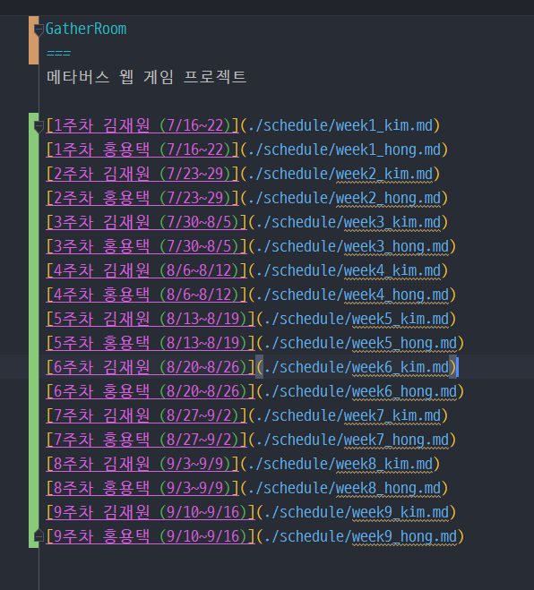

1주차 작업 김재원
===

1주차 목표
- 프로젝트 생성
- 프로젝트 틀 설계
- 기능별 설계 및 계획

프로젝트 생성
---

기본 Readme 문서를 작성하였음

프로젝트 틀 설계
---
- [x] 스프링 부트 파기 및 JPA 설정
- [x] 기본 서버 실행
- [x] 기본 test 객체 생성
- [x] 기본 home API 생성
- [x] 기본 home page 생성
- [x] JPA 기본 공부
- [x] 로그인 기능 구현

기능별 설계 및 계획
---

- 사용자 로그인 (구글 API)
- 웹소켓을 활용한 실시간 데이터 전송 (서버)
  - 채팅
  - 캐릭터 움직임
  - 음성채팅 (가능하면)
  - 화상채팅 (가능하면)
- 캔버스 API를 활용한 캐릭터 움직이기 (클라)